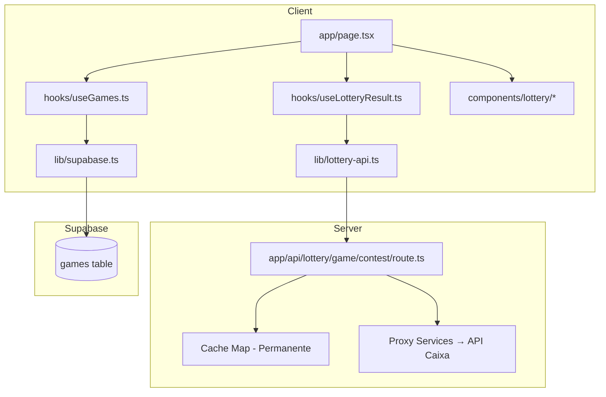
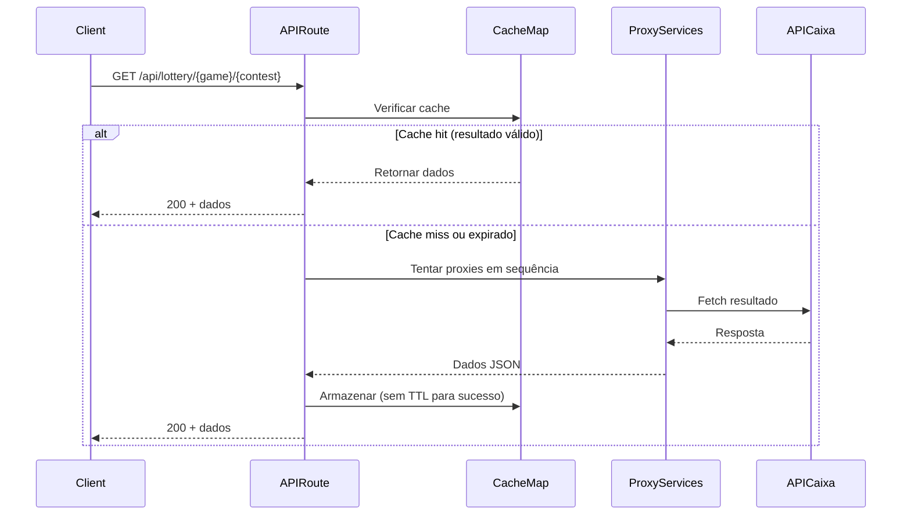
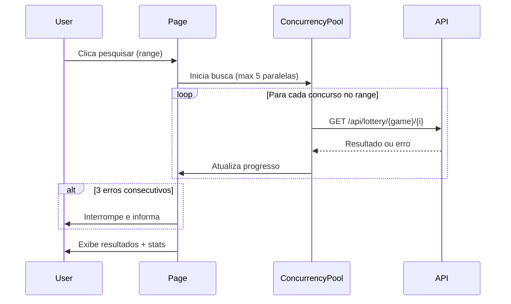

# Design — Melhorias de UX no App Loterias Caixa

## Overview

Este documento descreve o design técnico para as melhorias de UX, performance e manutenibilidade no aplicativo "Loterias Caixa - Meus Jogos". As mudanças abrangem:

1. **Cache permanente** de resultados da API no servidor e cliente
2. **Navegação automática** para o concurso mais recente ao pesquisar
3. **Busca direta** por número de concurso via campo numérico
4. **Separação visual** de jogos ativos vs. encerrados
5. **Remoção completa** do sistema de notificações push
6. **Melhorias de performance** na busca em lote com concorrência limitada
7. **Melhorias gerais de UX/UI** (skeletons, animações, contagens)

### Decisões de Design

- **Manter a arquitetura existente**: Next.js App Router + React Query + Supabase. Não introduzir novas dependências significativas.
- **Cache server-side permanente**: Alterar o `Map` existente na API route para não expirar resultados válidos (dados de concursos passados são imutáveis).
- **Cache client-side com staleTime infinito**: Resultados válidos nunca ficam "stale" durante a sessão.
- **Concorrência limitada com `p-limit`**: Usar uma implementação inline simples (sem nova dependência) para limitar requisições paralelas a 5.
- **Classificação ativo/encerrado**: Lógica pura no cliente comparando `concurso_fim` com o concurso mais recente da modalidade.

## Architecture



### Fluxo de Dados — Cache Permanente



### Fluxo — Busca em Lote com Concorrência



## Components and Interfaces

### Componentes Modificados

| Componente | Mudança |
|---|---|
| `app/page.tsx` | Remover push notifications, deep link, adicionar separação ativo/encerrado, campo busca concurso, skeletons |
| `app/api/lottery/[game]/[contest]/route.ts` | Cache permanente para resultados válidos |
| `hooks/useLotteryResult.ts` | staleTime infinito, gcTime 24h |
| `lib/lottery-api.ts` | Busca em lote com concorrência limitada (5) e early-stop |
| `components/lottery/GameCard.tsx` | Suporte a estilo "encerrado" (opacidade/grayscale) |

### Componentes Removidos

| Componente | Motivo |
|---|---|
| `hooks/usePushNotifications.ts` | Sistema push não funcional |
| `app/api/push/subscribe/route.ts` | Sistema push não funcional |
| `app/api/push/notify/route.ts` | Sistema push não funcional |
| `public/sw-push.js` | Sistema push não funcional |
| `app/api/debug/route.ts` | Expõe informações internas |

### Novos Componentes

| Componente | Responsabilidade |
|---|---|
| `components/lottery/ContestSearch.tsx` | Campo de busca direta por número de concurso |
| `components/lottery/GameSection.tsx` | Seção de jogos (ativos ou encerrados) com título e contagem |
| `components/lottery/GameCardSkeleton.tsx` | Skeleton de carregamento para cards de jogos |

### Interfaces Novas/Modificadas

```typescript
// lib/lottery-api.ts — Nova função de busca em lote com concorrência
interface BatchSearchOptions {
  game: string;
  startContest: number;
  endContest: number;
  concurrency?: number; // default: 5
  onProgress?: (checked: number, total: number) => void;
  onResult?: (contest: number, result: LotteryResult) => void;
  maxConsecutiveErrors?: number; // default: 3
}

interface BatchSearchResult {
  results: Map<number, LotteryResult>;
  mostRecentContest: number | null;
  totalChecked: number;
  stoppedEarly: boolean;
}

export async function fetchLotteryResultsBatch(
  options: BatchSearchOptions
): Promise<BatchSearchResult>;

// lib/lottery-utils.ts — Classificação de jogos
export function classifyGame(
  game: Game,
  latestContest: number
): "active" | "ended";

export function getLatestContestForGame(game: Game): number;
```

### ContestSearch Props

```typescript
interface ContestSearchProps {
  currentContest: number;
  minContest: number;
  maxContest: number;
  onSearch: (contest: number) => void;
  disabled?: boolean;
}
```

### GameSection Props

```typescript
interface GameSectionProps {
  title: string;
  count: number;
  games: Game[];
  config: LotteryConfig;
  variant: "active" | "ended";
  onDelete: (id: string) => void;
  onSearch: (game: Game) => void;
  onUpdateContest: (id: string, inicio: number, fim: number | null) => void;
  isDeleting?: boolean;
}
```

## Data Models

### Cache Server-Side (Modificado)

```typescript
// app/api/lottery/[game]/[contest]/route.ts

type CacheEntry = {
  result: CacheResult;
  timestamp: number;
};

// TTL por tipo de resultado:
// - Resultado válido (data !== null): SEM TTL (permanente)
// - Not found (notFound === true): 60 segundos
// - Erro (error !== null): 30 segundos

const cache = new Map<string, CacheEntry>();
```

### Cache Client-Side (Modificado)

```typescript
// hooks/useLotteryResult.ts
// Para resultados válidos:
{
  staleTime: Infinity,    // Nunca refetch automático
  gcTime: 24 * 60 * 60 * 1000, // 24 horas no garbage collector
}
```

### Classificação de Jogos

```typescript
// Lógica de classificação:
// - Jogo_Ativo: concurso_fim (ou concurso_inicio se fim=null) >= latestContest
// - Jogo_Encerrado: concurso_fim (ou concurso_inicio se fim=null) < latestContest

// O "latestContest" é obtido do campo `numero` do último resultado
// buscado com sucesso para aquela modalidade de loteria.
```

### Arquivos Removidos (Push System)

- `hooks/usePushNotifications.ts`
- `app/api/push/subscribe/route.ts`
- `app/api/push/notify/route.ts`
- `public/sw-push.js`
- `app/api/debug/route.ts`
- Dependência `web-push` do `package.json`
- Tipo `@types/web-push` do `devDependencies`
- Cron jobs do `vercel.json`


## Correctness Properties

*A property is a characteristic or behavior that should hold true across all valid executions of a system — essentially, a formal statement about what the system should do. Properties serve as the bridge between human-readable specifications and machine-verifiable correctness guarantees.*

### Property 1: Contest search validation

*For any* game with `concurso_inicio` and `concurso_fim`, and *for any* integer `n`, submitting `n` to the contest search field should be accepted (navigate to contest `n`) if and only if `concurso_inicio <= n <= concurso_fim` (or `n == concurso_inicio` when `concurso_fim` is null). Otherwise, the submission should be rejected and the current contest should remain unchanged.

**Validates: Requirements 3.2, 3.3**

### Property 2: Non-numeric input rejection

*For any* string that is empty or contains non-numeric characters, submitting it to the contest search field should leave the current contest unchanged (no navigation occurs).

**Validates: Requirements 3.4**

### Property 3: Game classification correctness

*For any* game with `concurso_inicio` and optional `concurso_fim`, and *for any* positive integer `latestContest`, the function `classifyGame(game, latestContest)` should return `"active"` if and only if `getLatestContestForGame(game) >= latestContest`, and `"ended"` otherwise. Where `getLatestContestForGame` returns `concurso_fim` if defined, or `concurso_inicio` if `concurso_fim` is null.

**Validates: Requirements 4.1**

### Property 4: Batch search concurrency limit

*For any* range of contests `[start, end]` where `end - start >= 5`, the batch search function should never have more than 5 requests in-flight simultaneously at any point during execution.

**Validates: Requirements 6.1**

### Property 5: Batch search progress reporting

*For any* range of contests, the `onProgress` callback should be called with `(checked, total)` where `checked` increases monotonically (each call has `checked` >= previous call's `checked`), `total` equals the range size, and the final `checked` value equals the total number of contests actually checked.

**Validates: Requirements 6.2**

### Property 6: Batch search early stop on consecutive errors

*For any* sequence of API responses during a batch search, if 3 consecutive errors (404 or network failure) occur, the batch search should stop immediately, return `stoppedEarly: true`, and the results map should contain only the successfully fetched results up to that point.

**Validates: Requirements 6.4**

## Error Handling

### API Route (`/api/lottery/[game]/[contest]`)

| Cenário | Comportamento | Cache |
|---|---|---|
| Resposta 200 válida | Retorna dados, status 200 | Permanente (sem TTL) |
| Resposta 404 / não encontrado | Retorna erro, status 404 | TTL 60s |
| Todos os proxies falharam | Retorna erro, status 502 | TTL 30s |
| Resposta HTML (bloqueio) | Tenta próximo proxy | — |
| JSON inválido | Tenta próximo proxy | — |
| Timeout (20s) | Tenta próximo proxy | — |

### Busca em Lote (Client-Side)

| Cenário | Comportamento |
|---|---|
| 3 erros consecutivos | Interrompe busca, exibe resultados parciais |
| Erro de rede individual | Conta como erro consecutivo, continua |
| 404 individual | Conta como erro consecutivo, continua |
| Resultado válido após erros | Reseta contador de erros consecutivos |

### Validação do Campo de Busca

| Input | Comportamento |
|---|---|
| Número dentro do range | Navega para o concurso |
| Número fora do range | Exibe toast de erro, mantém concurso atual |
| String vazia | Ignora, mantém concurso atual |
| Caracteres não numéricos | Ignora (input type=number previne) |
| Número negativo ou zero | Ignora, mantém concurso atual |

### Classificação de Jogos

| Cenário | Comportamento |
|---|---|
| Nenhum resultado buscado ainda para a modalidade | Todos os jogos são classificados como "ativos" (fallback seguro) |
| `latestContest` disponível | Classificação normal baseada na comparação |

## Testing Strategy

### Abordagem Dual

**Unit Tests (example-based):**
- Verificar configuração de cache (TTLs corretos)
- Verificar remoção completa do sistema push (smoke tests)
- Verificar renderização de componentes (skeletons, seções, contagens)
- Verificar comportamento de UI (animações presentes, estilos aplicados)

**Property Tests (property-based):**
- Biblioteca: `fast-check` (TypeScript/JavaScript)
- Mínimo 100 iterações por propriedade
- Cada teste referencia a propriedade do design document

### Configuração de Property Tests

```typescript
import fc from "fast-check";

// Cada teste deve rodar no mínimo 100 iterações
const PBT_CONFIG = { numRuns: 100 };
```

### Mapeamento de Testes

| Propriedade | Tipo | Arquivo de Teste |
|---|---|---|
| Property 1: Contest search validation | PBT | `__tests__/contest-search.property.test.ts` |
| Property 2: Non-numeric input rejection | PBT | `__tests__/contest-search.property.test.ts` |
| Property 3: Game classification | PBT | `__tests__/game-classification.property.test.ts` |
| Property 4: Concurrency limit | PBT | `__tests__/batch-search.property.test.ts` |
| Property 5: Progress reporting | PBT | `__tests__/batch-search.property.test.ts` |
| Property 6: Early stop | PBT | `__tests__/batch-search.property.test.ts` |

### Tags de Teste

Cada property test deve incluir um comentário com a tag:

```
// Feature: lottery-ux-improvements, Property 1: Contest search validation
// Feature: lottery-ux-improvements, Property 2: Non-numeric input rejection
// Feature: lottery-ux-improvements, Property 3: Game classification correctness
// Feature: lottery-ux-improvements, Property 4: Batch search concurrency limit
// Feature: lottery-ux-improvements, Property 5: Batch search progress reporting
// Feature: lottery-ux-improvements, Property 6: Batch search early stop on consecutive errors
```

### Testes de Integração

- Verificar que o build compila sem erros após remoção do push
- Verificar que a API route retorna dados do cache corretamente
- Verificar que React Query popula o cache durante batch search

### Testes Manuais

- Verificar animações de transição entre concursos
- Verificar responsividade em dispositivos móveis
- Verificar comportamento offline (PWA cache)
